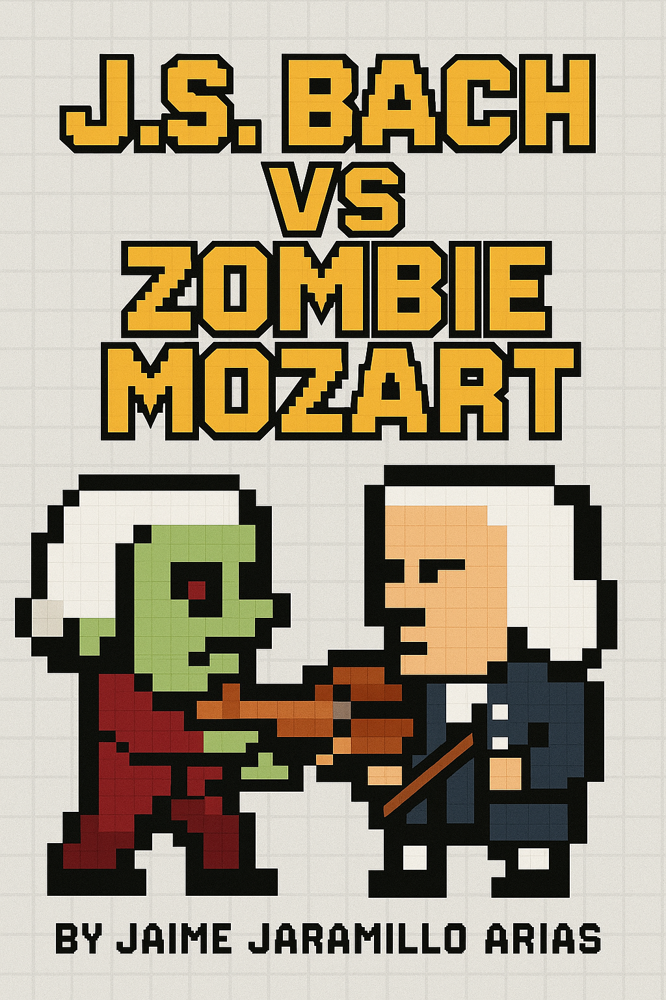

# 🎻 J.S. Bach vs Zombie Mozart

¡El shooter musical más épico de la historia!



---

## 🕹️ Juega aquí:

👉 [¡Abrir juego en GitHub Pages!](https://jaimejaramilloarias.github.io/jsbach-shooter/)

---

## 📖 Descripción

Juega como **J.S. Bach** en una batalla pixelada contra hordas de **Mozarts zombis**.  
Corre, dispara y salta para evitar obstáculos musicales y recolecta símbolos para ganar puntos y vidas.  
¡Cuida tus vidas y mejora tu puntaje!  
Hecho para que puedas disfrutarlo desde cualquier navegador.

---

## 🎮 Controles

- **Moverse:** Flechas del teclado (↑ ↓ ← →)
- **Disparar:** Tecla `B` (mantén presionado para disparo continuo)
- **Comenzar o reiniciar:** Clic o cualquier tecla
- **Evita o destruye a los zombies para sobrevivir!**

---

## 🎵 Créditos de audio e imágenes

- Diseño, pixel art, mecánica y sonidos:  
  **Jaime Jaramillo Arias**
- Música de fondo y efectos:  
  FreeSound.org / Libre uso

---

## ✨ ¿Qué tecnologías usa?

- [Phaser 3](https://phaser.io/)
- HTML5, JavaScript, CSS
- GitHub Pages para hosting gratuito

---

## 🚀 Cómo jugar en local

1. Descarga este repositorio:  
   ```bash
   git clone https://github.com/jaimejaramilloarias/jsbach-shooter.git
