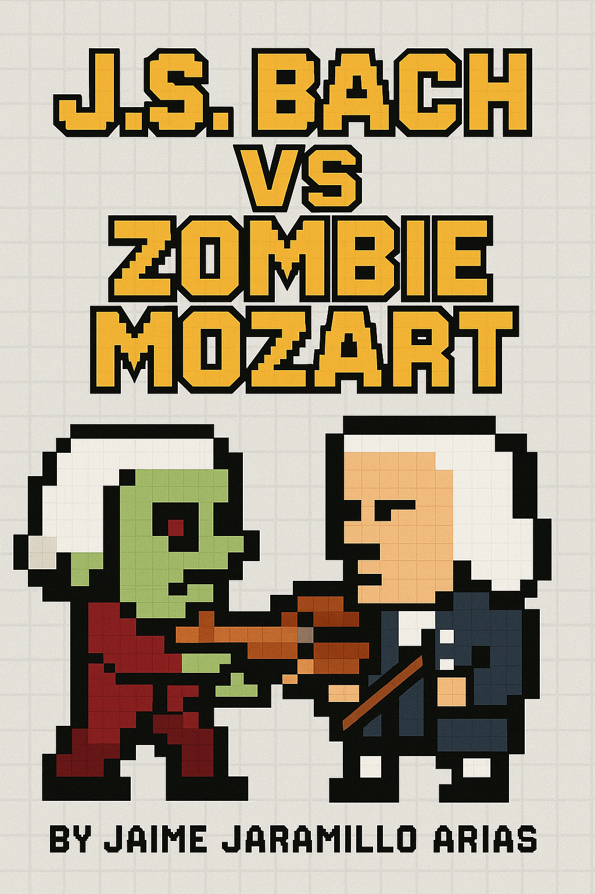

# J.S. Bach vs Zombie Mozart

Shooter musical hecho con Phaser 3. Juegas como J.S. Bach contra oleadas de Zombie Mozart, recolectando intervalos para subir score, activar poderes y sostener el combo.



## Jugar

[Abrir juego en GitHub Pages](https://jaimejaramilloarias.github.io/jsbach-shooter/)

## Controles

- Moverse: flechas o WASD
- Disparar: `B` o espacio
- Pausar: `P`
- Audio: `M`
- Tactil: joystick virtual + boton `FIRE`

## Mejoras incluidas

- Escalado responsive con Phaser `FIT`.
- Menu, pausa y game over reales.
- HUD redisenado con score, vidas, oleada, combo, record y poderes activos.
- Oleadas progresivas con tempo creciente y cambio de escenario cada seis oleadas.
- Cinco niveles con fondos 8-bit de baja resolucion: Aula de contrapunto, Iglesia de Arnstadt, Corte de Weimar, Sala de la fuga y Leipzig nocturna como final.
- Tipos de enemigos: normal, rapido, resistente, movimiento en canon y jefe cada 5 oleadas.
- Power-ups musicales:
  - Tercera: puntos y combo.
  - Sexta: escudo breve.
  - Cuarta aumentada: disparo triple.
  - Clave de do: vida extra.
  - Quintas/octavas: penalizaciones.
- Audio controlado con mute y manejo seguro de autoplay.
- Controles tactiles para telefono o tablet.
- Metadata social, manifest web y boton de pantalla completa para publicacion web.
- Phaser incluido localmente en `vendor/phaser.min.js`, sin depender de CDN durante la partida.
- Limpieza de `node_modules` y archivos `.DS_Store` fuera del repo.

## Desarrollo local

```bash
npm start
```

Luego abre:

```text
http://127.0.0.1:4173/
```

## Verificacion

```bash
npm test
```

La prueba smoke valida que existan los archivos principales, que el HTML cargue Phaser y `game.js`, y que el juego conserve las piezas esperadas: responsive scale, HUD, controles tactiles, oleadas, jefe, power-ups y audio seguro.
